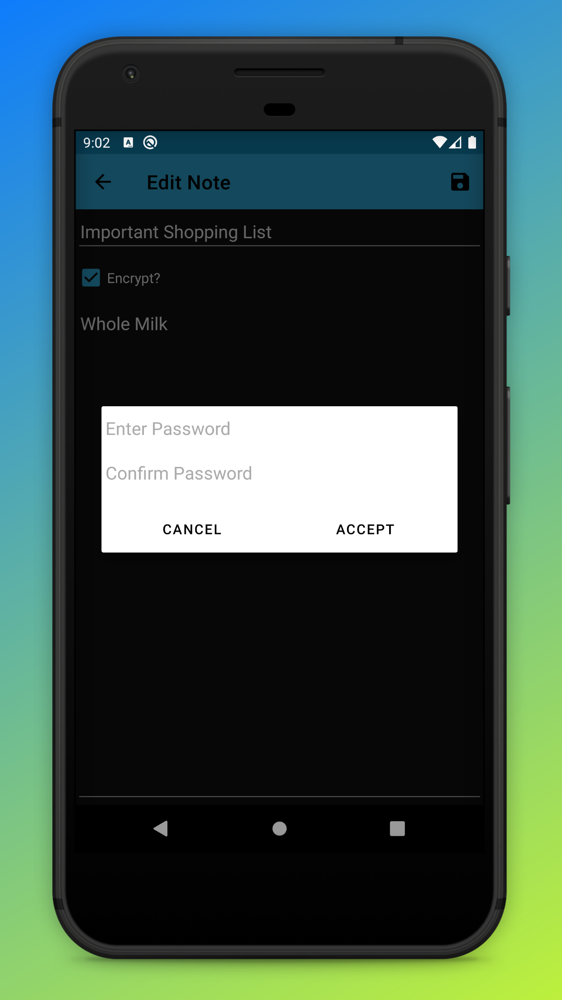

Secure Note
===========
Another android note app that allows encrypting notes individually or not at all. Very simple function and presentation. Simply opt to encrypt a note when adding a new note or when editing an old note and enter a password.

Screenshots
-----------

	
	
	
    

TODO
----
* Change to fragments to support a multi-pane view for tablets.